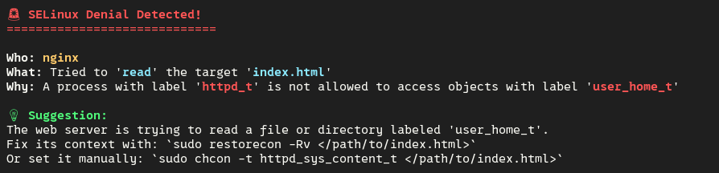

<h1 align="center">🔐 selinux-explain</h1>

<p align="center">
  <em>Translates cryptic SELinux AVC denials into plain, human-readable English.</em>
</p>

<p align="center">
  
  
  
  
</p>

---

## 🤔 Why this tool?

SELinux is a lifesaver, but reading its `audit.log` is often a nightmare.

When SELinux blocks something, most people either paste incomprehensible logs on StackOverflow or — worse — run `setenforce 0` and forget about it. Tools like `setroubleshoot` help, but they require a Python daemon running in the background, bring in heavy dependencies, and are not ideal for minimal, headless, or air-gapped servers.

`selinux-explain` is different:

- **Single static binary** — no daemon, no D-Bus, no runtime dependencies
- **Offline by default** — no API calls, no data sent outside your machine
- **Human-readable output** — tells you what happened, why it was blocked, and how to fix it without disabling SELinux
- **Works everywhere SELinux does** — Fedora, RHEL, Rocky Linux, AlmaLinux, CentOS Stream

---

## 🚀 Installation

### Build from source

```bash
git clone https://github.com/mattiabandini1/selinux-explain.git
cd selinux-explain
cargo build --release
sudo cp target/release/selinux-explain /usr/local/bin/
```

That's it. The binary is now available system-wide.

> Pre-compiled binaries are coming soon via GitHub Releases.

---

## 🛠️ Usage

**Analyze the latest AVC denial in your system log:**

```bash
sudo selinux-explain --last
```

**Analyze a specific log line:**

```bash
selinux-explain --text "type=AVC msg=audit(1612345678.123:456): avc: denied { read } for pid=1234 comm=\"nginx\" name=\"index.html\" scontext=system_u:system_r:httpd_t:s0 tcontext=unconfined_u:object_r:user_home_t:s0 tclass=file"
```

**Pipe directly from the audit log:**

```bash
grep nginx /var/log/audit/audit.log | selinux-explain
```

---

## 📤 Example output
>
> **Note:** The suggestion shown below is currently generic for unlisted process types. Context-aware suggestions for common cases (`httpd_t`, `container_t`, and more) are already implemented and actively being expanded.



---

## 🗺️ Roadmap

- [x] Parse AVC denial log lines with regex
- [x] Human-readable output with color
- [x] `--last` flag to analyze the latest denial from `/var/log/audit/audit.log`
- [x] `--text` flag to analyze a specific log line
- [x] Context-aware suggestions for common cases (httpd_t, container_t).
- [ ] Extended suggestion engine via external `rules.toml`.
- [ ] Stdin / pipe support
- [ ] Pre-compiled binaries via GitHub Releases
- [ ] RPM package / COPR repository

---

## 🤝 Contributing

Pull requests are welcome! If you find a log that doesn't parse correctly, please open an issue with the raw log string.

---

<p align="center">
  Made with ❤️ and Rust by <a href="https://mattiabandini.com">Mattia Bandini</a>
</p>
